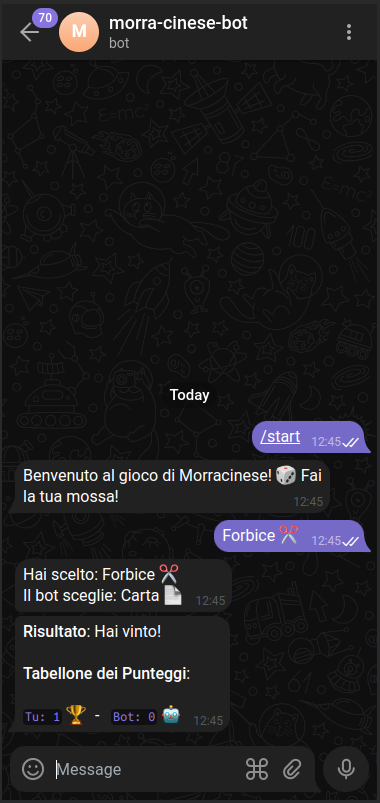

# Crea il tuo Bot Telegram:

1. Avvia una chat con **BotFather** su Telegram.
2. Usa il comando `/newbot` e segui le istruzioni per creare un nuovo bot. Ti verrà fornito un **token**.
3. Salva il token, ti servirà per collegare il tuo bot al codice.

# Configura il tuo ambiente di sviluppo:

1. Assicurati di avere **Node.js** installato sul tuo computer.
2. Apri il terminale e naviga nella directory del tuo progetto.
3. Esegui `npm i` per installare tutte le dipendenze necessarie.
4. Esegui `npm start` per avviare il bot.

# Inizia a lavorare sul tuo Bot Telegram:

1. Utilizza il token ottenuto da BotFather per collegare il tuo bot al codice.
   - Esempio: `const bot = new Telegraf('IL_TUO_TELEGRAM_BOT_TOKEN');`
2. Aggiungi funzionalità al bot utilizzando la libreria **Telegraf.js**.
   - Gestisci i comandi: `bot.command('comando', (ctx) => {...});`
   - Rispondi ai messaggi: `bot.on('message', (ctx) => {...});`
3. Sperimenta aggiungendo funzioni personalizzate e logica di interazione.
4. Utilizza `ctx.reply()` per inviare risposte agli utenti.
5. Testa il bot frequentemente per assicurarti che funzioni come previsto.

> **Nota**: Ricorda di sostituire 'IL_TUO_TELEGRAM_BOT_TOKEN' con il token effettivo del tuo bot. Assicurati inoltre di avere installato Telegraf.js nel tuo progetto.

# Screenshot:

